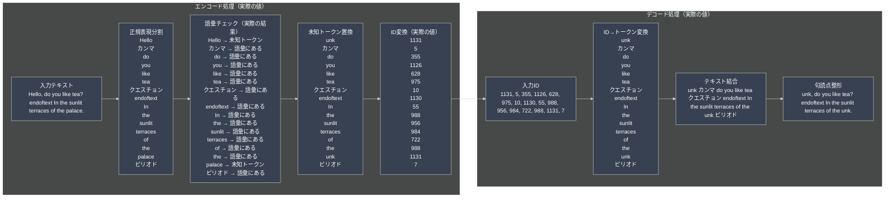
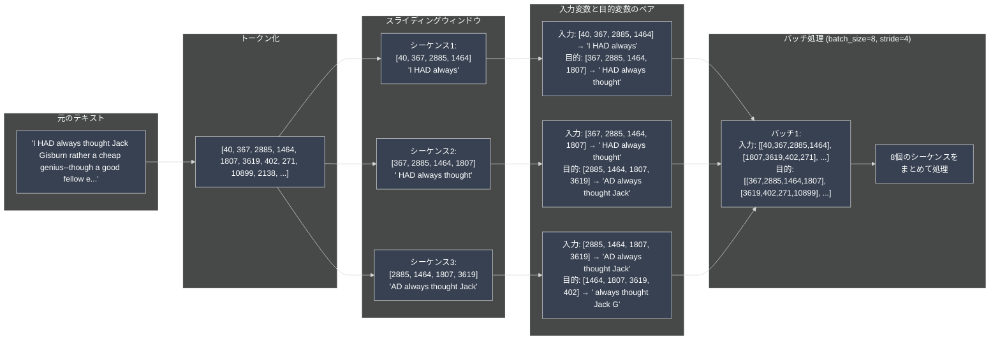

# LLM-Tukuttemita

https://github.com/rasbt/LLMs-from-scratch/tree/main/setup/01_optional-python-setup-preferences


## HandmadeTokenizer.py

**目的**: LLM用のテキストトークナイザーを自作し、テキストを機械学習で処理可能な数値形式に変換する

**重要**: このファイルは独自のトークナイザーを実装し、テキストの数値化方法を学習するためのもの

### やっていること

1. **学習元データの準備**
- GitHubから短編小説「The Verdict」をダウンロード
- ローカルファイルとして保存（the-verdict.txt）
- 実際のテキスト例：'I HAD always thought Jack Gisburn rather a cheap genius...'

2. **テキストのトークン化**
- 正規表現を使ってテキストを単語や句読点に分割
- 実例：'I HAD always thought Jack Gisburn rather a cheap genius--though a good fellow enough--so it was no g'
- 結果：['I', 'HAD', 'always', 'thought', 'Jack', 'Gisburn', 'rather', 'a', 'cheap', 'genius', '--', 'though', ...]

3. **語彙（辞書）の構築**
- 全てのユニークなトークンを収集・整理（1132個）
- アルファベット順にソート：['!', '"', "'", '(', ')', ',', '--', '.', ':', ';', ...]
- 特殊トークンを追加：`<|endoftext|>`（文章の終端）、`<|unk|>`（未知の単語）

4. **トークンIDの割り当て**
- 各トークンに一意の数値IDを割り当て
- 実例：'!' → 0, '"' → 1, "'" → 2, '(' → 3, ')' → 4, ',' → 5, ...
- 語彙辞書の作成：{トークン: ID}の形式

5. **エンコード・デコード機能の実装**
- **エンコード**: テキスト → トークンID列
- **デコード**: トークンID列 → テキスト
- 未知トークンの処理：語彙にない単語は`<|unk|>`に置換

### このファイルの役割

```
[生テキスト] → [トークン化] → [語彙構築] → [ID割り当て] → [エンコード/デコード機能]
                                                            ↑
                                                HandmadeTokenizer.pyの担当範囲
```

- ✅ 独自トークナイザーの実装
- ✅ テキストの数値化
- ✅ 語彙辞書の構築
- ✅ エンコード・デコード機能
- ❌ 実際の学習・予測
- ❌ 高度な自然言語処理

### 実際の処理例

```
入力テキスト: "Hello, do you like tea?"
↓ トークン化
['Hello', ',', 'do', 'you', 'like', 'tea', '?']
↓ ID変換（'Hello'と'tea'は語彙にない）
[<|unk|>, 5, 355, 1126, 628, 975, 10]
↓ エンコード結果
[1131, 5, 355, 1126, 628, 975, 10]
↓ デコード結果
"<|unk|>, do you like tea?"
```

### 未知トークンの処理

- 'Hello' → `<|unk|>`（未知トークン）
- 'palace' → `<|unk|>`（未知トークン）
- 語彙にない単語は自動的に`<|unk|>`に置換される




## BytePairEncorder.py

**目的**: LLM学習の前処理として、テキストデータを機械学習で使用可能な形式に変換・整理する

**重要**: このファイルは実際の学習（予測）は行わず、学習用データの準備のみを行う

### やっていること

1. **データの前処理**
- the-verdict.txtから生テキストを読み込み
- tiktoken（GPT-2トークナイザー）でテキストをトークンIDに変換
- 数値データとして機械学習で処理可能な形式に変換

2. **スライディングウィンドウによるデータ分割**
- 元のテキストを固定長のシーケンス（塊）に分割
- stride（歩幅）を指定して次のシーケンスとの重複を制御
- 実例：'I HAD always' → ' HAD always thought' → 'AD always thought Jack'

3. **入力変数と目的変数のペア作成**
- 入力変数：現在のシーケンス（例：'I HAD always'）
- 目的変数：1つ先にずらしたシーケンス（例：' HAD always thought'）
- **注意**: 目的変数は予測結果ではなく、the-verdict.txtから取得した正解データ

4. **PyTorchデータセットクラスの実装**
- GPTdatasetV1クラスで学習用データを管理
- PyTorchのDatasetクラスを継承し、標準的なデータ処理を実装
- バッチ処理とシャッフル機能に対応

5. **データローダーの作成**
- 複数のデータをまとめて効率的に処理（バッチ処理）
- 学習データの順番をランダム化（シャッフル）
- 並列処理でデータ読み込みを高速化

### このファイルの役割

```
[生テキスト] → [前処理] → [学習用データ] → [実際の学習（別ファイル）]
                ↑
        BytePairEncorder.pyの担当範囲
```

- ✅ データの準備・整理
- ✅ 学習用形式への変換
- ❌ 実際の学習・予測
- ❌ モデルの訓練

### 実際の処理例

```
元のテキスト: "I HAD always thought Jack Gisburn rather a cheap genius..."
↓ トークン化
[40, 367, 2885, 1464, 1807, 3619, 402, 271, 10899, 2138, ...]
↓ スライディングウィンドウ（max_length=4）
入力: [40, 367, 2885, 1464] → 'I HAD always'
正解: [367, 2885, 1464, 1807] → ' HAD always thought'
```

