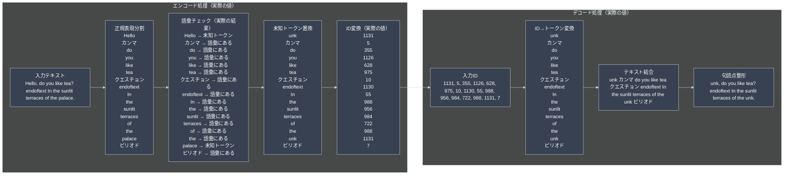
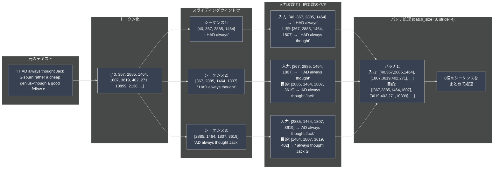

# LLM-Tukuttemita

https://github.com/rasbt/LLMs-from-scratch/tree/main/setup/01_optional-python-setup-preferences


<details>
<summary>HandmadeTokenizer.py</summary>

### 概要
テキストを機械学習で扱える数値（トークンID）に変換する、シンプルなトークナイザーの実装です。

### データ処理の流れ

1. **サンプルテキストの準備**
   - 「The Verdict」という短編小説をダウンロード（自動）
   - 約5,000単語のテキストデータ

2. **トークン化処理**
   - 正規表現 `r'([,.:;?_!"()\']|--|\s)'` でテキストを分割
   - 単語と句読点を個別のトークンとして扱う
   - 例: "Hello, world!" → ['Hello', ',', 'world', '!']

3. **語彙辞書の構築**
   - テキスト内の全ユニークトークンを収集（1132個）
   - 各トークンに一意のIDを割り当て
   - 特殊トークンの追加:
     - `<|endoftext|>`: 文章の終端マーカー（ID: 1130）
     - `<|unk|>`: 語彙にない単語用（ID: 1131）

4. **エンコード・デコード処理**
   - エンコード: テキスト → トークン分割 → ID変換
   - デコード: ID列 → トークン復元 → テキスト結合

### 実際の処理例

```python
# エンコード処理
text = "Hello, do you like tea?"
ids = tokenizer.encode(text)
# 処理の流れ:
# 1. トークン分割: ['Hello', ',', 'do', 'you', 'like', 'tea', '?']
# 2. 語彙チェック: Hello → <|unk|>, tea → <|unk|>
# 3. ID変換: [1131, 5, 355, 1126, 628, 1131, 10]

# デコード処理
decoded = tokenizer.decode(ids)
# 処理の流れ:
# 1. ID→トークン: [1131, 5, 355, 1126, 628, 1131, 10]
#                → ['<|unk|>', ',', 'do', 'you', 'like', '<|unk|>', '?']
# 2. 結合・整形: "<|unk|>, do you like <|unk|>?"
```

### データ変換の詳細図



### ポイント
- 教育目的のシンプルな実装で、トークン化の基本原理を理解できる
- 語彙サイズが小さい（1132個）ため、多くの単語が未知語になる
- 実用的なトークナイザー（BPE、WordPiece等）の基礎となる概念

</details>

<details>
<summary>bytePairEncorder.py</summary>

### 概要
GPT-2のトークナイザー（tiktoken）を使用して、LLM学習用のデータを準備するファイルです。テキストを固定長のシーケンスに分割し、次の単語を予測する学習データを作成します。

### データ処理の流れ

1. **テキストのトークン化**
   - GPT-2のBPE（Byte Pair Encoding）トークナイザーを使用
   - 語彙サイズ: 50,257トークン
   - 例: "I HAD always" → [40, 367, 2885]

2. **スライディングウィンドウによるシーケンス生成**
   - `max_length`: シーケンスの長さ（例: 4）
   - `stride`: ウィンドウの移動幅（例: 1）
   - オーバーラップにより、データを最大限活用

3. **入力と目的変数のペア作成**
   - 入力: 現在のトークン列
   - 目的変数: 1つずつ右にシフトしたトークン列（次の単語を予測）
   ```
   入力:  [40, 367, 2885, 1464]
   目的:  [367, 2885, 1464, 1807]
   ```

4. **バッチ処理の準備**
   - 複数のシーケンスをまとめて処理
   - GPUでの並列計算に最適化

### 実際のデータ処理例

```python
# パラメータ設定
context_size = 4  # シーケンス長
stride = 1        # 1トークンずつシフト
batch_size = 8    # 8個のシーケンスを同時処理

# データの流れ
# 1. テキスト: "I HAD always thought Jack Gisburn..."
# 2. トークンID: [40, 367, 2885, 1464, 1807, 3619, ...]
# 3. シーケンス分割:
#    - seq1: [40, 367, 2885, 1464] → [367, 2885, 1464, 1807]
#    - seq2: [367, 2885, 1464, 1807] → [2885, 1464, 1807, 3619]
#    - seq3: [2885, 1464, 1807, 3619] → [1464, 1807, 3619, 402]
```

### データ変換の詳細図



### 重要なポイント

- **次の単語予測タスク**: LLMの基本的な学習方法
- **スライディングウィンドウ**: 限られたデータを最大限活用
- **バッチ処理**: GPU計算の効率化
- **PyTorchとの統合**: 標準的な深層学習フレームワークに対応

</details>


<details>
<summary>self-attention.py</summary>

このSled-Attentionでの目標は入力シーケンスの各要素に対してコンテキストベクトルを計算すること

</details>